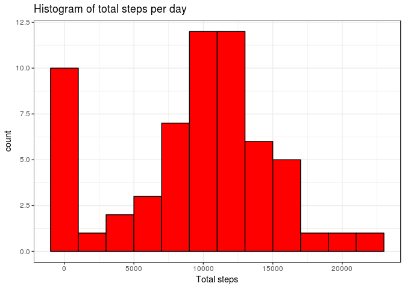
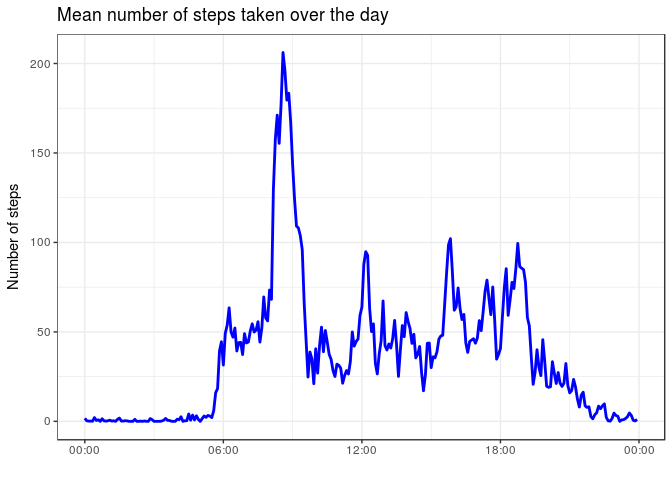
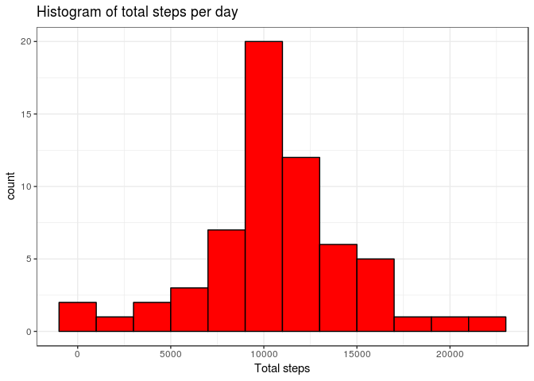
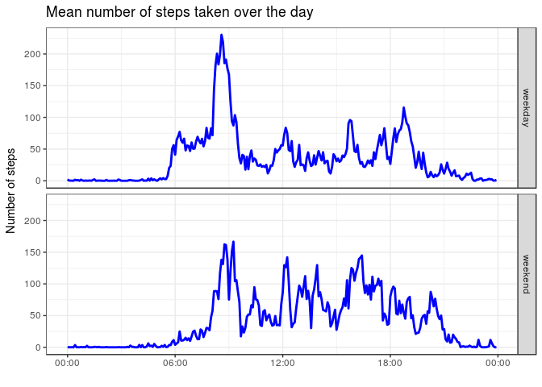

# Reproducible Research: Peer Assessment 1


## Loading and preprocessing the data

```r
library(dplyr)
```

```
## 
## Attaching package: 'dplyr'
```

```
## The following objects are masked from 'package:stats':
## 
##     filter, lag
```

```
## The following objects are masked from 'package:base':
## 
##     intersect, setdiff, setequal, union
```

```r
library(ggplot2)
active_data <- read.csv("activity.csv")
active_data$date <- as.Date(as.character(active_data$date))
active_data$time <- substr(as.POSIXct(sprintf("%04.0f", active_data$interval), 
                                      format='%H%M'), 12, 16)
active_data$time <- as.POSIXct(active_data$time, format="%H:%M")
```

## What is mean total number of steps taken per day?

```r
result <- summarise(group_by(active_data, date), sumsteps=sum(steps, na.rm=TRUE))
result
```

```
## # A tibble: 61 × 2
##          date sumsteps
##        <date>    <int>
## 1  2012-10-01        0
## 2  2012-10-02      126
## 3  2012-10-03    11352
## 4  2012-10-04    12116
## 5  2012-10-05    13294
## 6  2012-10-06    15420
## 7  2012-10-07    11015
## 8  2012-10-08        0
## 9  2012-10-09    12811
## 10 2012-10-10     9900
## # ... with 51 more rows
```

```r
ggplot(result, aes(sumsteps)) + geom_histogram(binwidth = 2000, col="black", fill="red") +
        theme_bw() +
        labs(title="Histogram of total steps per day", x="Total steps")
```

<!-- -->

```r
paste("The mean number of steps per day is:", mean(result$sumsteps),
      "and the median number of steps per day is:", median(result$sumsteps))
```

```
## [1] "The mean number of steps per day is: 9354.22950819672 and the median number of steps per day is: 10395"
```

## What is the average daily activity pattern?

```r
result2 <- summarise(group_by(active_data, time), meansteps=mean(steps, na.rm=TRUE))
ggplot(result2, aes(time, meansteps)) + geom_line(col="blue", lwd=1) + theme_bw() +
        labs(title="Mean number of steps taken over the day", y="Number of steps") +
        scale_x_datetime("", date_labels = "%H:%M")
```

<!-- -->

```r
paste("On average, the maximum number of steps was taken at",
      strftime(result2$time[which.max(result2$meansteps)], format="%H:%M"))
```

```
## [1] "On average, the maximum number of steps was taken at 08:35"
```

## Imputing missing values

```r
paste("There are", sum(is.na(active_data$steps)), "missing values in the data")
```

```
## [1] "There are 2304 missing values in the data"
```

```r
print("We will replace these with the mean value of that 5 minute interval")
```

```
## [1] "We will replace these with the mean value of that 5 minute interval"
```

```r
active_data2 <- active_data
for (i in 1:nrow(active_data2)){
        if (is.na(active_data2$steps[i])){
                active_data2$steps[i] <- result2$meansteps[grep(format(active_data2$time[i], 
                                                                "%H%M"), format(result2$time,
                                                                "%H%M"))]
        }
}
result3 <- summarise(group_by(active_data2, date), sumsteps=sum(steps, na.rm=TRUE))

ggplot(result3, aes(sumsteps)) + geom_histogram(binwidth = 2000, col="black", fill="red") +
        theme_bw() +
        labs(title="Histogram of total steps per day", x="Total steps")
```

<!-- -->

```r
paste("The mean number of steps per day is:", mean(result3$sumsteps),
      "and the median number of steps per day is:", median(result3$sumsteps))
```

```
## [1] "The mean number of steps per day is: 10766.1886792453 and the median number of steps per day is: 10766.1886792453"
```

```r
print("Imputing the missing data increases the mean to be much closer to the median and reshapes the histogram.")
```

```
## [1] "Imputing the missing data increases the mean to be much closer to the median and reshapes the histogram."
```

## Are there differences in activity patterns between weekdays and weekends?

```r
active_data2$day <- "weekday"
active_data2$day[grepl("^S", weekdays(active_data2$date))] <- "weekend"
active_data2$day <- as.factor(active_data2$day)

result4 <- summarise(group_by(active_data2, day, time), meansteps=mean(steps, na.rm=TRUE))
ggplot(result4, aes(time, meansteps)) + geom_line(col="blue", lwd=1) + theme_bw() +
        labs(title="Mean number of steps taken over the day", y="Number of steps") +
        scale_x_datetime("", date_labels = "%H:%M") + facet_grid(day~.)
```

<!-- -->
